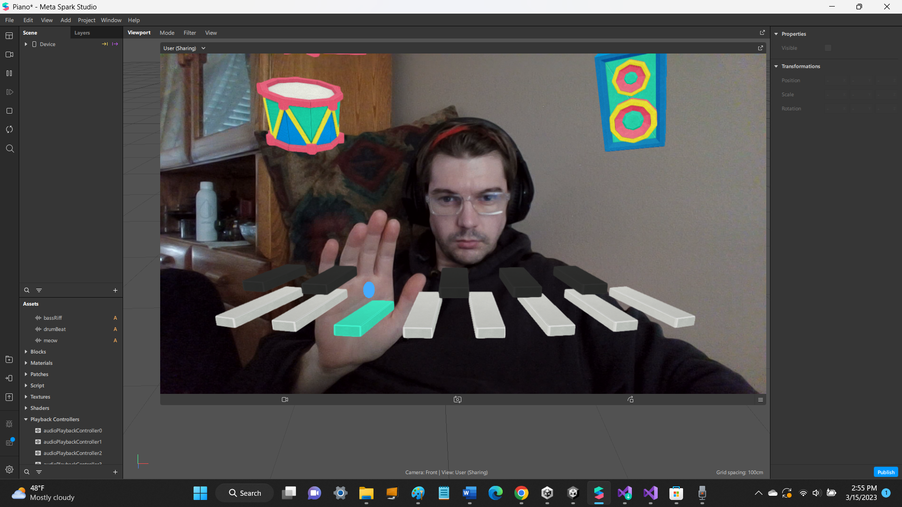

# ar-piano

[Meta Spark Studio](https://sparkar.facebook.com/ar-studio/) - Create Immersive AR Experiences

## Description
Augmented reality (AR) piano app that harnesses Spark AR to create a virtual piano projected into your 3D environment via your smartphone camera input

## Examples

## Demo / Develop
There are a few different ways to run this Scratch code. It can be done offline or online. If you have a stable internet connection, the easiest way is to use Scratch's online editor.

1. [Fork](https://docs.github.com/en/get-started/quickstart/fork-a-repo) this repository.

2. [Download Spark AR Studio](https://sparkar.facebook.com/ar-studio/)

3. Use Spark AR Studio to open the [`piano-demo.arproj`](piano-demo/piano-demo.arproj) file.

## Controls

Move your hand's (or both hands') green cursor over a piano key, the drum, or the speaker to highlight the element and trigger its audio track to play.

## Author
Kevin Baron

## License

## Helpful Links

[Meta Spark Studio](https://sparkar.facebook.com/ar-studio/) - Create Immersive AR Experiences
